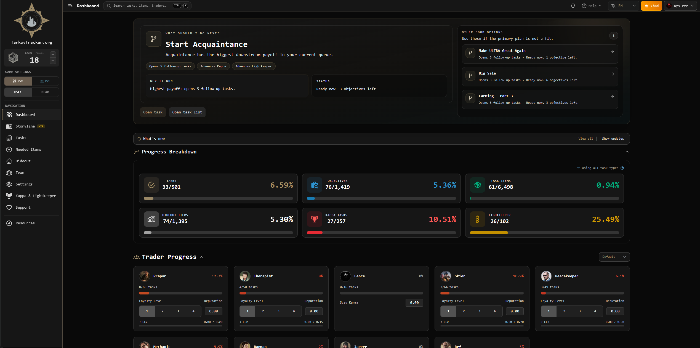

# TarkovTracker

[](https://crowdin.com/project/tarkovtrackerorg)
[](https://codecov.io/gh/tarkovtracker-org/TarkovTracker)

TarkovTracker tracks Escape from Tarkov tasks, hideout upgrades, required items, levels, and team
progress separately for PvP and PvE.

[](https://tarkovtracker.org)

**Try it live at <https://tarkovtracker.org>.**

---

## Using TarkovTracker

You can start tracking your progress immediately — **no account required**. Your progress is saved
in your browser's local storage and stays there between visits.

### What works without an account

- Track task and objective completion (PvP and PvE separately)
- Track hideout module upgrades and the parts you still need
- View player level, faction progress, and needed items
- Browse interactive maps with spawn points and objectives
- Customize display preferences and game mode
- All data persists locally in your browser

### What an account enables

Sign in (via Discord, Twitch, Google, or GitHub) when you want to:

- **Sync progress across devices** — your progress follows you to any browser
- **Create or join a team** — share progress with teammates in real time
- **Share your profile** — let others view your progress via a shareable link
- **Use API tokens** — programmatically read your progress via the public API
- **Back up your data** — server-side storage protects against browser data loss

> **Signing in:** If you have local progress and create a new account, that progress uploads to
> your account on first login. Returning users (same browser, same account) get a merge of local
> and cloud progress. If you sign into an existing account from a new browser that already has
> cloud progress, the cloud data takes precedence — your local guest progress is not merged.

### Getting help

- **Questions or bugs?** See [`SUPPORT.md`](SUPPORT.md) for where to ask.
- **Found a security issue?** See [`SECURITY.md`](SECURITY.md) for how to report it privately.
- **Community:** Join us on [Discord](https://discord.gg/M8nBgA2sT6) or
  [GitHub Discussions](https://github.com/tarkovtracker-org/TarkovTracker/discussions).
- **Translations:** Help translate at
  [translate.tarkovtracker.org](https://translate.tarkovtracker.org). Supported languages:
  English, German, Spanish, French, Russian, Ukrainian, and Chinese.

---

<!-- Everything below this line is for developers and contributors. -->
<!-- If you just want to use TarkovTracker, visit https://tarkovtracker.org. -->

## For Developers and Contributors

The rest of this README covers local development and contributing. If you only want to use
TarkovTracker, visit **<https://tarkovtracker.org>** — no setup required.

### Local development

```bash
corepack enable        # enables pnpm via Corepack (Node >=24.12.0)
pnpm install
pnpm run dev           # http://localhost:3000
```

Copy `.env.example` to `.env` and fill in your Supabase values. Without Supabase configured, the
app runs in offline mode with localStorage only — auth, sync, realtime, and team features are
unavailable.

> Only `NUXT_PUBLIC_SUPABASE_URL` and `NUXT_PUBLIC_SUPABASE_ANON_KEY` are required for login/sync.
> Everything else is optional and documented in [`docs/ARCHITECTURE.md`](docs/ARCHITECTURE.md).

**Tech stack:** Nuxt 4 (SPA, `ssr: false`), Vue 3 Composition API, TypeScript strict, Pinia,
Supabase, Tailwind CSS v4, Vitest, Cloudflare Pages/Workers.

### Common commands

| Task          | Command               |
| ------------- | --------------------- |
| Dev server    | `pnpm run dev`        |
| Build         | `pnpm run build`      |
| Preview build | `pnpm run preview`    |
| Lint          | `pnpm run lint`       |
| Typecheck     | `pnpm run typecheck`  |
| Tests         | `pnpm run test`       |
| Test watch    | `pnpm run test:watch` |

Run `pnpm run lint`, `pnpm run typecheck`, and `pnpm run test` before pushing. The full command
list (including i18n, Supabase types, OpenAPI validation, and the API gateway tests) is in
[`AGENTS.md`](AGENTS.md) and [`docs/WORKFLOW_AUTOMATION.md`](docs/WORKFLOW_AUTOMATION.md).

### Contributing

Each pull request must address **one change only** — a single fix, update, doc improvement, or
feature. PRs that bundle unrelated changes may be asked to split or be closed.

- **[How to contribute](.github/CONTRIBUTING.md)** — issues, branches, PR process, and the PR
  template.
- **[Label system](.github/LABELS.md)** — issue types, scope, priority, ownership, and status.
- **[Project board](.github/PROJECT_BOARD.md)** — how issues move from backlog to done.

> New to the codebase? Start with
> [`.github/CONTRIBUTING.md`](.github/CONTRIBUTING.md) for the development workflow and PR process.
> When available, issues labeled
> [`good-first-issue`](https://github.com/tarkovtracker-org/TarkovTracker/labels/good-first-issue)
> are scoped for newcomers.

### Documentation

The short version: this README gets you running; the `docs/` folder explains how things work.

| You want to…                                      | Read                                                                                       |
| ------------------------------------------------- | ------------------------------------------------------------------------------------------ |
| Get started                                       | This README                                                                                |
| Report a security vulnerability                   | [`SECURITY.md`](SECURITY.md)                                                               |
| Find where to get help                            | [`SUPPORT.md`](SUPPORT.md)                                                                 |
| Read the code of conduct                          | [`CODE_OF_CONDUCT.md`](CODE_OF_CONDUCT.md)                                                 |
| Understand the systems (caching, data, overlay)   | [`docs/SYSTEMS.md`](docs/SYSTEMS.md)                                                       |
| Understand the full architecture & data flow      | [`docs/ARCHITECTURE.md`](docs/ARCHITECTURE.md)                                             |
| Read the Tarkov data architecture decision        | [`docs/decisions/tarkov-data-architecture.md`](docs/decisions/tarkov-data-architecture.md) |
| Use or extend the HTTP/API surface                | [`docs/API.md`](docs/API.md)                                                               |
| Understand rate limits / abuse controls           | [`docs/RATE_LIMITING.md`](docs/RATE_LIMITING.md)                                           |
| Deploy, configure env vars, or handle an incident | [`docs/runbook.md`](docs/runbook.md)                                                       |
| Understand CI/CD, hooks, and releases             | [`docs/WORKFLOW_AUTOMATION.md`](docs/WORKFLOW_AUTOMATION.md)                               |
| Contribute (issues, branches, PRs, labels)        | [`.github/CONTRIBUTING.md`](.github/CONTRIBUTING.md)                                       |
| Work as (or configure) an AI agent                | [`AGENTS.md`](AGENTS.md) + [`docs/agent-context/`](docs/agent-context/)                    |

Start at [`docs/README.md`](docs/README.md) if you are not sure which doc you need.

### Project structure

```text
app/         Nuxt 4 source (features, stores, server routes, shell, locales)
supabase/    Database migrations and edge functions
workers/     Cloudflare Workers (public API gateway)
scripts/     Precompute and other tooling
docs/        Project documentation
public/      Static assets
```

See [`docs/ARCHITECTURE.md`](docs/ARCHITECTURE.md) for the full module map and
[`docs/SYSTEMS.md`](docs/SYSTEMS.md) for how the non-obvious systems (Tarkov.dev integration,
multi-layer caching, overlay corrections, precompute) actually work.

### License

GNU General Public License v3.0 — see [`LICENSE.md`](LICENSE.md).
