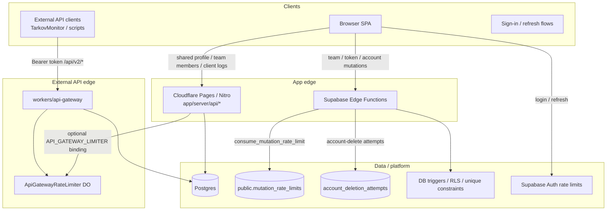
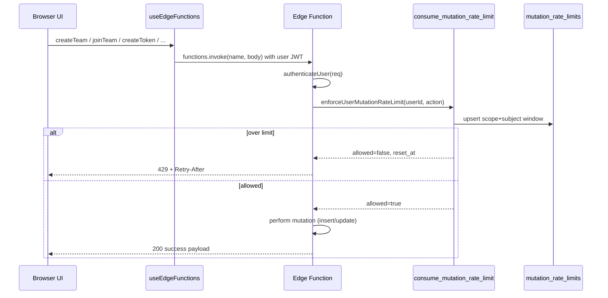
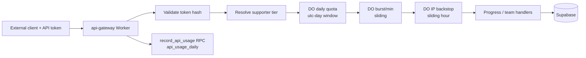
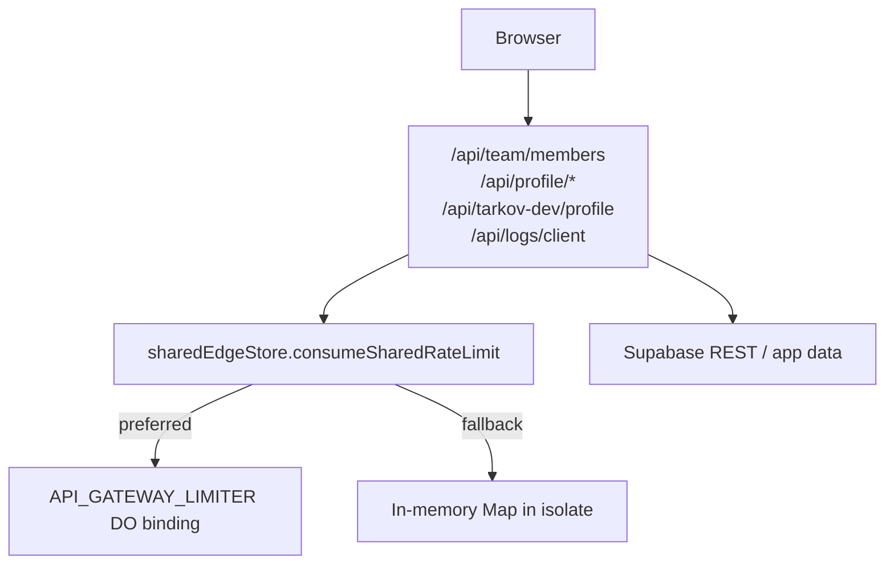
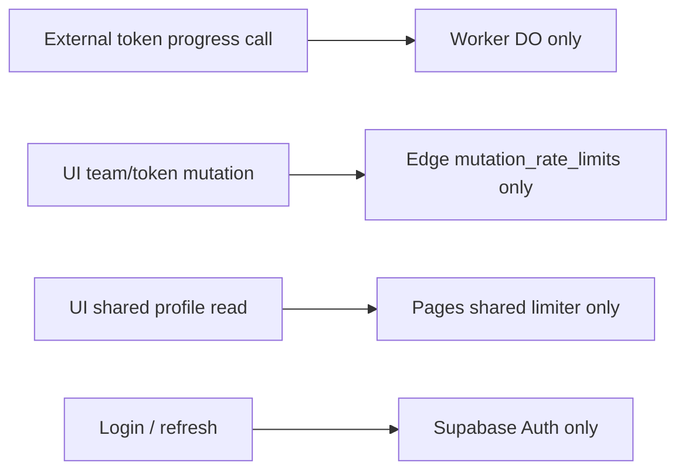
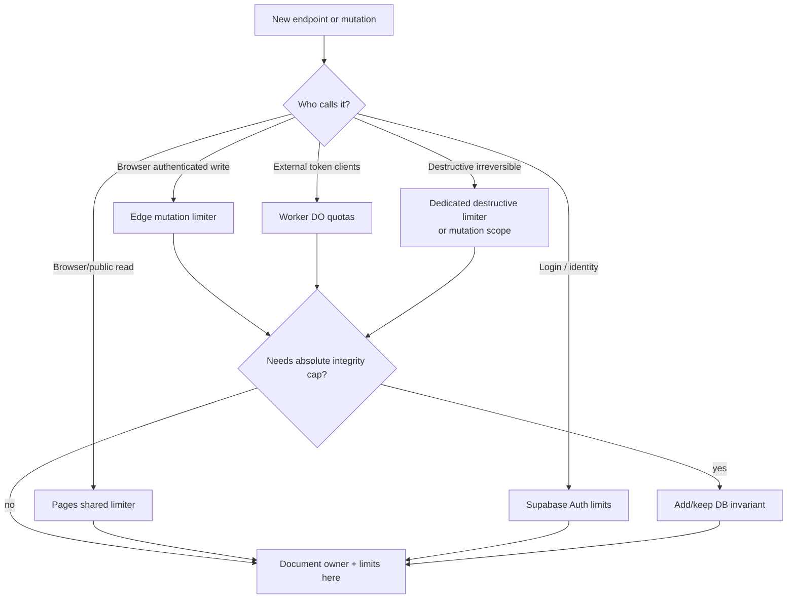

# Rate Limiting & Abuse Controls

This document is the **ownership map** for every rate-limit / abuse system in TarkovTracker.

If you are about to add a new limiter, read this first. Most confusion in this repo comes from
assuming “we already rate-limit everything in one place.” We do **not**. Different traffic classes
have different enforcers on purpose.

Related docs:

- External progress API quotas: [`API.md`](./API.md#rate-limits-api-gateway)
- System architecture: [`ARCHITECTURE.md`](./ARCHITECTURE.md)
- Incident knobs: [`runbook.md`](./runbook.md)

---

## Design principle

> **One primary enforcer per traffic class, at the closest trusted edge.**  
> Frontend cooldowns are UX only. Database rules are hard invariants. Platform auth limits stay
> with Supabase Auth.

| Layer                             | May enforce?                          | Notes                                         |
| --------------------------------- | ------------------------------------- | --------------------------------------------- |
| Browser UI                        | UX only                               | Disable double-submit / toast; never security |
| Cloudflare Pages / Nitro `/api/*` | Yes (app reads / internal endpoints)  | Prefer Durable Object binding when available  |
| Cloudflare Worker (`api-gateway`) | Yes (external token API)              | Primary high-QPS enforcer                     |
| Supabase Edge Functions           | Yes (authenticated mutations)         | Critical low-frequency writes                 |
| Postgres                          | Hard caps / durable mutation counters | Not for high-QPS API traffic                  |
| Supabase Auth platform            | Yes (login / refresh / signup)        | Do not reimplement                            |

---

## Traffic classes and owners



### Ownership matrix

| Traffic class               | Examples                                         | Primary enforcer                               | Secondary / hard stop                    | Storage / implementation                   |
| --------------------------- | ------------------------------------------------ | ---------------------------------------------- | ---------------------------------------- | ------------------------------------------ |
| External progress API       | `/api/v2/*` on `api.tarkovtracker.org`           | Worker DO quotas (daily + burst + IP backstop) | Supporter tier resolution, token auth    | `ApiGatewayRateLimiter`, `api_usage_daily` |
| Authenticated app mutations | team create/join/leave/kick, token create/revoke | Edge Function mutation limiter                 | DB token cap (3 active), RLS             | `mutation_rate_limits` + RPC               |
| Public / shared app reads   | shared profile, team members, tarkov-dev profile | Pages/Nitro shared limiter                     | CDN/cache TTLs, Cloudflare WAF if needed | `sharedEdgeStore` (+ DO if bound)          |
| Destructive account ops     | account delete                                   | Edge Function (dedicated table for now)        | Deletion jobs queue                      | `account_deletion_attempts`                |
| Auth platform               | signup, sign-in, refresh, OTP                    | Supabase Auth                                  | Captcha (optional)                       | GoTrue `[auth.rate_limit]`                 |
| Outbound third parties      | Discord API, Stripe                              | Provider `Retry-After` / SDK rules             | Circuit breakers, job retries            | not user quotas                            |

---

## End-to-end flows

### A. Authenticated app mutations (`mutation_rate_limits`)

Still fully integrated and live.



**Frontend entrypoints**

- Teams: `app/features/team/*` via `app/composables/api/useEdgeFunctions.ts`
- Tokens: `app/features/settings/ApiTokens.vue` via the same composable

**Edge Functions (enforced today)**

| Function       | Scope key      | Limit | Window |
| -------------- | -------------- | ----: | ------ |
| `team-create`  | `team-create`  |    10 | 1 hour |
| `team-join`    | `team-join`    |    30 | 10 min |
| `team-leave`   | `team-leave`   |    30 | 1 hour |
| `team-kick`    | `team-kick`    |    20 | 1 hour |
| `token-create` | `token-create` |     3 | 1 hour |
| `token-revoke` | `token-revoke` |    50 | 10 min |

Source of truth for limits: `supabase/functions/_shared/rate-limit.ts`  
RPC + table: migration `supabase/migrations/20260404120000_add_mutation_rate_limit_rpc.sql`

**How the counter works**

1. Key = `(scope, subject)` where `subject` is the authenticated user id.
2. Fixed window of `window_seconds`.
3. If no row or `now >= reset_at`, start a new window at count `1`.
4. Else if `count >= limit`, deny.
5. Else increment and allow.
6. Uses a transaction advisory lock so concurrent requests for the same subject cannot stampede.

**Security posture**

- RLS enabled; deny-all policy for clients
- `anon` / `authenticated` have no table grants
- only `service_role` / SECURITY DEFINER RPC can mutate counters

**Known bypass gaps**

- **Token create** is Edge-only by default. Direct `api_tokens` insert is only used when
  `NUXT_PUBLIC_ALLOW_DIRECT_TOKEN_CREATE_FALLBACK=true` (default **false** in `nuxt.config.ts` /
  `ApiTokens.vue`). Keep that flag off in production so create stays on the Edge limiter.
- **Token revoke** has an automatic unavailable-function fallback to direct delete in
  `useEdgeFunctions.revokeToken`. That path **skips** the Edge limiter; DB/RLS still apply.
- The DB still enforces the **max 3 active tokens** trigger even if rate limiting is skipped.
- Prefer keeping create/revoke behind Edge Functions in production and avoid enabling create
  fallbacks.

**Hygiene**

Expired rows are harmless but accumulate. Safe cleanup:

```sql
DELETE FROM public.mutation_rate_limits
WHERE reset_at < now() - interval '1 day';
```

---

### B. External API gateway (Worker + Durable Object)

This is the high-volume system used by token-authenticated progress clients. It does **not** use
`mutation_rate_limits`.



**Primary limits** (from `workers/api-gateway/src/limits.ts`):

| Tier      | Reads/day | Writes/day | Burst/min |
| --------- | --------: | ---------: | --------: |
| Free      |     1,000 |        100 |        30 |
| Supporter |     2,000 |        250 |        60 |
| Scav      |     2,000 |        250 |        60 |
| Timmy     |     3,000 |        400 |        90 |
| Chad      |     5,000 |        600 |       120 |

Plus IP backstop: **600 reads/hour**, **200 writes/hour** per IP.

Details and response headers: [`API.md`](./API.md#rate-limits-api-gateway)

Implementation notes:

- Enforcer class: `ApiGatewayRateLimiter` in `workers/api-gateway/src/index.ts`
- Keys are namespaced (`daily-read:<userId>`, `burst-write:<userId>`, `ip-...`)
- Burst uses sliding windows so a TarkovMonitor batch at a minute boundary is not spuriously blocked
- Throttled requests can refund daily/burst slots when a later check fails
- Usage observability goes to `public.api_usage_daily` (not a limiter itself)

---

### C. Pages / Nitro shared app endpoints

Used for browser/app read endpoints served by Cloudflare Pages Functions.



| Endpoint                       | Prefix / key style          | Default       | Env override                                |
| ------------------------------ | --------------------------- | ------------- | ------------------------------------------- |
| `/api/team/members`            | `team-members-rate:*`       | 120 / min     | `NUXT_TEAM_MEMBERS_RATE_LIMIT_PER_MINUTE`   |
| `/api/profile/[userId]/[mode]` | `shared-profile-rate:*`     | 120 / min     | `NUXT_SHARED_PROFILE_RATE_LIMIT_PER_MINUTE` |
| `/api/tarkov-dev/profile`      | `tarkov-dev-profile-rate:*` | 30 / min / IP | fixed in route                              |
| `/api/logs/client`             | `client-logs-rate:ip:...`   | 10 / min / IP | fixed in route                              |

Implementation: `app/server/utils/sharedEdgeStore.ts`

Important:

- When the DO binding is present, enforcement is shared across isolates.
- Without it, fallback is best-effort in-memory and can under-enforce under concurrency or restarts.
- These limits protect **app endpoints**, not the external progress API.

---

### D. Account deletion limiter

`account-delete` currently uses a **dedicated** path:

1. Query recent rows in `account_deletion_attempts` for the user
2. Allow max **3 attempts / 60s**
3. Insert an attempt row, then enqueue deletion work

This is **not** wired through `consume_mutation_rate_limit` today. Functionally fine, but it is a
second pattern for “sensitive mutation limiting.”

Preferred future shape: add an `account-delete` scope to the shared mutation limiter and keep
`account_deletion_attempts` only if audit history is still needed.

---

### E. Hard DB invariants (not QPS limits)

These are correctness rules that survive any Edge/Worker outage:

| Rule                         | Mechanism                               |
| ---------------------------- | --------------------------------------- |
| Max 3 active API tokens      | DB trigger / constraint on `api_tokens` |
| One membership per user+mode | unique index                            |
| Row ownership                | RLS policies                            |
| Discord link uniqueness      | unique constraint                       |

Do not replace these with rate limits.

---

### F. Supabase Auth platform limits

Configured in `supabase/config.toml` under `[auth.rate_limit]`:

- `sign_in_sign_ups`
- `token_refresh`
- `token_verifications`
- email / SMS / anonymous / web3 caps

Session lifetime controls (inactivity / timebox) are **auth garbage-collection policy**, not API
rate limits. They reduce long-lived sessions and refresh-token history growth.

---

## What does _not_ belong where

| Do this                                                        | Don’t do this                                                |
| -------------------------------------------------------------- | ------------------------------------------------------------ |
| Put external API QPS limits in the Worker DO                   | Put high-QPS API throttling in Postgres                      |
| Put team/token mutation abuse limits in Edge + durable counter | Rely on client button disables for security                  |
| Put public profile scrape limits on the Pages endpoint         | Count those requests against supporter daily API quotas      |
| Keep Auth login limits in Supabase Auth                        | Build a second login limiter in app code without reason      |
| Keep hard token caps in DB triggers                            | Soften security by “rate limiting instead of enforcing caps” |

---

## Conflict / double-count guidance

Today these systems mostly **do not stack on the same request**:



You can still get confusing UX if:

1. the same human action eventually touches two systems over time (create token limited by Edge;
   later progress polling limited by Worker quotas)
2. client fallbacks skip Edge and then only the DB hard cap remains
3. docs/agents talk about “the rate limiter” without specifying which one

When debugging a `429`, identify **which edge returned it** first:

| Symptom source                                                      | Likely enforcer             |
| ------------------------------------------------------------------- | --------------------------- |
| `api.tarkovtracker.org` response with `X-RateLimit-*` daily headers | Worker DO                   |
| Edge Function JSON `{ error: "Too many requests..." }`              | `mutation_rate_limits`      |
| Pages `/api/profile` or `/api/team/members` 429                     | sharedEdgeStore limiter     |
| Auth/login failures / refresh storms                                | Supabase Auth               |
| Token create 409 “Token limit reached (3 active)”                   | DB hard cap, not rate limit |

---

## Decision guide for new work

When adding a new endpoint or mutation, pick **exactly one** primary enforcer:



Checklist for every new limiter:

1. Name the traffic class
2. Choose the enforcer from the ownership matrix
3. Define key (`userId`, `ip`, `token owner`, etc.)
4. Define limit + window + fail-open/fail-closed behavior
5. Document it in this file and, if external, in `API.md`
6. Avoid inventing a third backend “because it was convenient”

---

## Operational notes

### Fail behavior

| System                          | On limiter failure                                                                               |
| ------------------------------- | ------------------------------------------------------------------------------------------------ |
| Edge mutation RPC error         | Edge returns **503** “Rate limiter unavailable” (fail closed for that mutation)                  |
| Worker DO timeout / error       | Request gets limiter-unavailable **503** path (or IP backstop may fail open depending on branch) |
| Pages shared limiter without DO | Falls back to in-memory best effort                                                              |

Treat these deliberately; do not “make everything fail open” without understanding abuse impact.

### Observability

| System                   | Where to look                                                               |
| ------------------------ | --------------------------------------------------------------------------- |
| External API throttles   | Worker logs (`rate_limit_429`), `api_usage_daily`, admin API usage endpoint |
| Mutation throttles       | Edge Function logs (`[rate-limit] ...`), `mutation_rate_limits.updated_at`  |
| Pages endpoint throttles | Pages/Nitro logs from sharedEdgeStore warnings                              |
| Account delete throttles | `account_deletion_attempts`                                                 |
| Auth storms              | Supabase Auth logs / dashboard                                              |

### Cleanup / retention

| Store                       | Retention guidance                                                                       |
| --------------------------- | ---------------------------------------------------------------------------------------- |
| `mutation_rate_limits`      | Delete rows with `reset_at` older than 1 day periodically                                |
| `api_usage_daily`           | Keep finite retention (e.g. 90–180 days) for observability                               |
| Worker DO state             | Ephemeral keys self-clean via alarms; retained authenticated keys expire by window logic |
| `account_deletion_attempts` | Existing cleanup function / retention policy                                             |

---

## Source map (code)

| Concern                                | Location                                                                                                                                                            |
| -------------------------------------- | ------------------------------------------------------------------------------------------------------------------------------------------------------------------- |
| Mutation limit constants + Edge helper | `supabase/functions/_shared/rate-limit.ts`                                                                                                                          |
| Mutation RPC + table                   | `supabase/migrations/20260404120000_add_mutation_rate_limit_rpc.sql`                                                                                                |
| Edge consumers                         | `supabase/functions/{token-create,token-revoke,team-create,team-join,team-leave,team-kick}/`                                                                        |
| Frontend mutation callers              | `app/composables/api/useEdgeFunctions.ts`                                                                                                                           |
| Worker tier constants                  | `workers/api-gateway/src/limits.ts`                                                                                                                                 |
| Worker DO enforcer                     | `workers/api-gateway/src/index.ts` (`ApiGatewayRateLimiter`)                                                                                                        |
| Pages shared limiter                   | `app/server/utils/sharedEdgeStore.ts`                                                                                                                               |
| Pages consumers                        | `app/server/api/team/members.ts`, `app/server/api/profile/[userId]/[mode].get.ts`, `app/server/api/tarkov-dev/profile.get.ts`, `app/server/api/logs/client.post.ts` |
| Account-delete limiter                 | `supabase/functions/account-delete/index.ts`                                                                                                                        |
| Auth platform limits                   | `supabase/config.toml` `[auth.rate_limit]`                                                                                                                          |
| External API docs                      | `docs/API.md`                                                                                                                                                       |

---

## Target state (keep this simple)

```text
Browser UI
  ├─ sensitive writes  → Supabase Edge → mutation_rate_limits (+ DB invariants)
  ├─ shared/public reads → Pages/Nitro → DO/shared limiter
  └─ auth             → Supabase Auth platform limits

External clients (API tokens)
  └─ api-gateway Worker → DO quotas (daily / burst / IP) → Supabase data

Hard rules always in DB:
  active token cap, RLS, uniqueness, deletion job integrity
```

Do **not** collapse everything into a single global limiter. Keep the four planes separate:

1. **External API quotas**
2. **App mutation abuse limits**
3. **App public/shared read limits**
4. **Auth / platform limits**

That separation is what prevents inconsistent double-throttling and makes ownership obvious.
