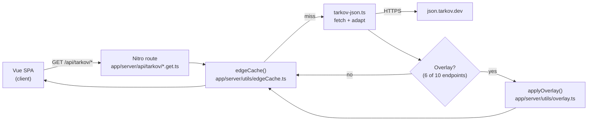
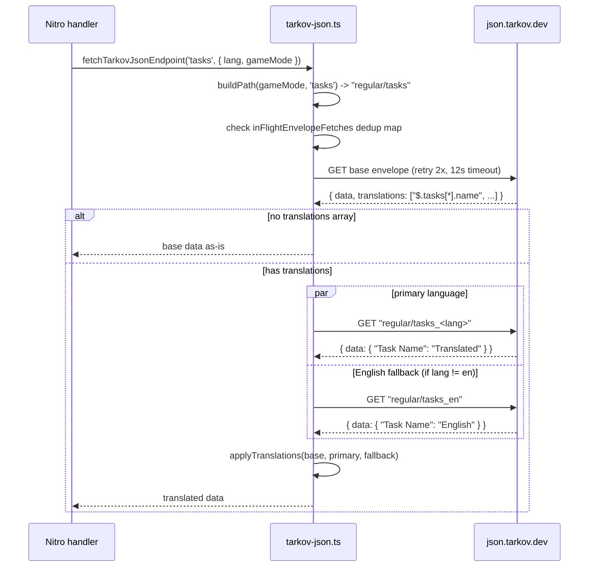
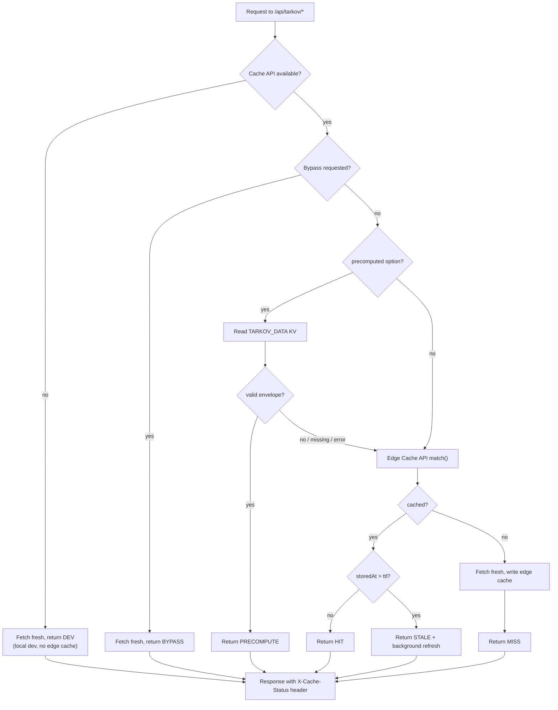
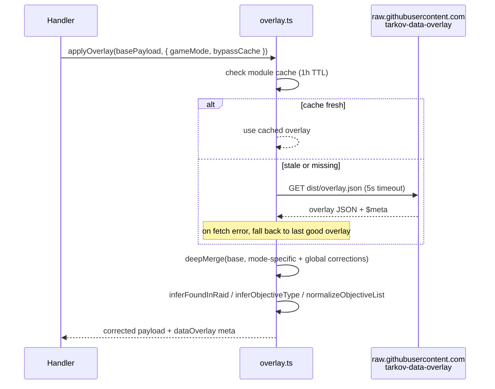
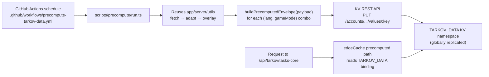

# TarkovTracker Systems Spec

This document explains **how the non-obvious systems in TarkovTracker actually work**, in plain
language with diagrams. It is the spec you point at when you want to ask "why does the app do X?"
and have an agent verify the answer against the code.

> **How to use this doc**
>
> - Each system has: a short plain-English summary, a diagram, a step-by-step flow, a list of the
>   files that implement it, and the **invariants** the code must hold. If the code and an invariant
>   disagree, the code is the bug (or the invariant is stale — fix the doc in the same PR).
> - File paths are relative to the repo root so agents can open them directly.
> - When a system changes, update its section here in the same PR. `AGENTS.md` enforces this.

## Systems covered

1. [Tarkov.dev data integration](#1-tarkovdev-data-integration) — where game data comes from
2. [Data fetching pipeline](#2-data-fetching-pipeline) — retries, timeouts, translations, dedup
3. [Multi-layer caching](#3-multi-layer-caching) — the four cache layers and how they fall through
4. [Overlay corrections](#4-overlay-corrections) — fixing wrong upstream data
5. [Precompute workflow](#5-precompute-workflow) — warming KV off the request path

---

## 1. Tarkov.dev data integration

**Summary.** TarkovTracker does not ship its own copy of the game database. Static game data
(tasks, hideout stations, items, maps, traders, prestige levels, player levels, map spawns) comes
from the community-maintained `json.tarkov.dev` static JSON API. The browser never calls
`json.tarkov.dev` directly — every request goes through our own Nitro server routes under
`/api/tarkov/*`. The server route fetches from upstream, adapts the raw JSON into the shape our
client expects, and (for most endpoints) applies corrections (see [Overlay](#4-overlay-corrections))
before returning it.

**Why a proxy instead of calling upstream from the browser?**

- We control caching headers and can serve stale-while-revalidate from the Cloudflare edge.
- We can apply the overlay and adapt the payload once on the server instead of in every client.
- We can keep the upstream retry/timeout budget server-side (see [Data fetching](#2-data-fetching-pipeline)).
- We avoid leaking the user's IP to a third party and avoid CORS quirks.

### Endpoints

| Endpoint                       | Purpose              | Cache TTL | Precomputed? | Overlay? |
| ------------------------------ | -------------------- | --------- | ------------ | -------- |
| `/api/tarkov/bootstrap`        | Player levels        | 12h       | no           | no       |
| `/api/tarkov/tasks-core`       | Tasks, maps, traders | 12h       | **yes**      | yes      |
| `/api/tarkov/tasks-objectives` | Task objectives      | 12h       | no           | yes      |
| `/api/tarkov/tasks-rewards`    | Task rewards         | 12h       | no           | yes      |
| `/api/tarkov/hideout`          | Hideout stations     | 12h       | no           | yes      |
| `/api/tarkov/items-lite`       | Items (minimal)      | 24h       | no           | yes      |
| `/api/tarkov/items`            | Items (full)         | 24h       | no           | yes      |
| `/api/tarkov/prestige`         | Prestige levels      | 24h       | no           | no       |
| `/api/tarkov/map-spawns`       | Map spawn points     | 12h       | no           | no       |
| `/api/tarkov/cache-meta`       | Cache purge status   | 5m edge   | no           | no       |

Overlay is applied by the six task/hideout/item endpoints. `bootstrap`, `prestige`,
`map-spawns`, and `cache-meta` fetch directly into `edgeCache` without the overlay step —
their upstream data does not currently need corrections.

Only `tasks-core` is precomputed today (it is the largest, hottest, and most expensive payload).
See [Precompute](#5-precompute-workflow).

### Diagram

### Files

- `app/server/api/tarkov/*.get.ts` — one handler per endpoint; thin wrappers around `edgeCache`.
- `app/server/utils/tarkov-json.ts` — upstream fetch + adapt into client types.
- `app/server/utils/tarkov-cache-config.ts` — TTL constants and game-mode validation.
- `app/types/tarkov.ts` — the adapted shapes the client stores.

### Invariants

- The browser must never call `json.tarkov.dev` directly. All static game data flows through
  `/api/tarkov/*`.
- Every endpoint handler returns its payload through `edgeCache()`; no handler fetches upstream
  outside the cache wrapper.
- Overlay is applied only by endpoints that call `applyOverlay()` in their handler. Adding a new
  endpoint does not imply adding overlay — only add it when the upstream data needs corrections.
- Game mode is validated with `validateGameMode()` and defaults to `regular` on any invalid input.
- Language is validated with `getValidatedLanguage()` and defaults to `en`.

---

## 2. Data fetching pipeline

**Summary.** `tarkov-json.ts` is the only module that talks to `json.tarkov.dev`. It fetches the
base (English) envelope, fetches the requested language envelope (and an English fallback if the
requested language is not English), then applies translations onto the base data. It has bounded
retries, a hard timeout, and deduplication of in-flight requests so a burst of cache misses for the
same payload only hits upstream once.

### Flow

### Retry, timeout, and dedup budget

- `DEFAULT_TIMEOUT_MS = 12000` per attempt, `DEFAULT_MAX_RETRIES = 2` attempts per envelope.
- Exponential backoff between attempts: 1s, then 2s, capped at 5s.
- The total upstream budget is bounded under Cloudflare's 100s origin limit. Worst case per route
  is roughly 2 legs (base + lang/en) × (2 retries × 12s + backoff) + overlay ≈ 55s, which fails
  fast (502) instead of triggering a 524.
- `inFlightEnvelopeFetches` is a module-level `Map<key, Promise>`. A concurrent cache miss for the
  same URL shares one upstream request. The key is `${url}|${timeoutMs}|${maxRetries}`.

### Translation application

`json.tarkov.dev` returns a `translations` array of JSONPath strings (e.g. `$.tasks[*].name`) that
point at string keys to look up in the language envelope. `applyTranslations` walks those paths and
replaces the key with the translated string.

- A fast path (`immutableUpdate`) handles the common JSONPath shapes (`*`, `prop[*]`, `prop`)
  without a dependency.
- If a path shape is not handled by the fast path, it falls back to `jsonpath-plus` for correctness.
- Primary language wins; English is the fallback when a key is missing in the primary language.

### Files

- `app/server/utils/tarkov-json.ts` — fetch, retry, dedup, adapt, translate.
- `app/server/utils/language-helpers.ts` — `getValidatedLanguage()`.

### Invariants

- Only `tarkov-json.ts` imports a fetcher for `json.tarkov.dev`. No other module hits upstream.
- Every upstream call uses `fetchEnvelope` (which enforces timeout + retry + dedup). No raw `$fetch`
  to upstream anywhere else.
- A missing translation falls back to English when available; otherwise, the original
  translation key is preserved.
- The upstream budget must stay under Cloudflare's 100s origin limit. If you add a new leg, budget
  it here.

---

## 3. Multi-layer caching

**Summary.** Game data is served from a four-layer cache that falls through on miss. The goal is:
**a warm colo never blocks on upstream, and a slow or failing upstream never blocks the user.**

### The four layers (in order)

1. **Precomputed KV** (globally replicated) — only when `edgeCache({ precomputed: true })`. Reads
   the `TARKOV_DATA` KV binding populated by the scheduled precompute workflow. See
   [Precompute](#5-precompute-workflow).
2. **Edge Cache API** (per-colo, Cloudflare `caches.default`) — the standard layer. Stores the
   adapted + overlay-applied payload with `s-maxage = ttl + staleTtl`.
3. **Upstream fetch** — on a cold miss, run the full pipeline (fetch → adapt → overlay) and write
   the result back into the edge cache.
4. **Dev fallback** — when running locally with no Cache API (`globalThis.caches` undefined), skip
   caching entirely and always fetch. Sets `X-Cache-Status: DEV`.

On top of these, the **client** has its own IndexedDB cache in `useMetadataStore` so the browser
does not re-fetch on every navigation. That layer is documented in `ARCHITECTURE.md`.

### Stale-while-revalidate

When an edge cache entry exists but is older than `ttl`, the handler:

1. Returns the stale payload immediately with `X-Cache-Status: STALE`.
2. Kicks off a background refresh via `reviveCacheEntry()`, guarded by an `inFlightRevalidations`
   set so only one refresh per key runs at a time.
3. Uses `ctx.waitUntil()` on Cloudflare so the response is not cut off when the request returns.

This is why a slow upstream never blocks a warm colo: the user gets stale data in milliseconds and
the refresh happens after the response is sent.

### Bypass

`shouldBypassCache(event)` returns true when `NUXT_CACHE_BYPASS_ENABLED` is on AND the request sends
`x-bypass-cache` / `x-cache-bypass` header, or `?nocache` / `?cacheBust` query. Bypass skips both KV
and edge cache, fetches fresh, and sets `X-Cache-Status: BYPASS`. Used for forcing a refresh after a
data correction.

### Diagram

### Response headers

| Header                | Meaning                                                             |
| --------------------- | ------------------------------------------------------------------- |
| `X-Cache-Status`      | One of `PRECOMPUTE`, `HIT`, `STALE`, `MISS`, `BYPASS`, `DEV`        |
| `X-Cache-Key`         | Full cache key (`prefix-key`)                                       |
| `Cache-Control`       | `public, max-age=ttl, s-maxage=ttl` for fresh; `no-cache` otherwise |
| `X-Overlay-Status`    | Overlay result (`fresh` / `cached` / `stale` / `missing`)           |
| `X-Overlay-Version`   | Overlay `$meta.version`                                             |
| `X-Overlay-Generated` | Overlay `$meta.generated` timestamp                                 |
| `X-Overlay-Sha256`    | Overlay `$meta.sha256`                                              |

### Files

- `app/server/utils/edgeCache.ts` — the `edgeCache()` function and `reviveCacheEntry()`.
- `app/server/utils/edgeCacheKey.ts` — builds the synthetic `Request` used as the Cache API key.
- `app/server/utils/edgeCacheSanitizers.ts` — sanitizes error messages before they reach the client.
- `app/server/utils/precomputedTarkov.ts` — KV binding contract shared with `scripts/precompute`.
- `app/server/utils/tarkov-cache-config.ts` — `CACHE_TTL_DEFAULT` (12h), `CACHE_TTL_EXTENDED` (24h).

### Invariants

- Cache layers must be checked in order: precomputed KV → edge Cache API → upstream. Never skip a
  layer or reorder them.
- A `STALE` response must always trigger exactly one background refresh (guarded by
  `inFlightRevalidations`).
- `X-Cache-Status` must be set on every successful response. Error responses from the
  catch block (502 on upstream failure) do not set it — the invariant covers the success
  paths only.
- The cache key must include language and game mode so two locales or modes never share an entry.
- The precomputed envelope is only trusted if `isPrecomputedEnvelope()` returns true; a corrupt
  write falls through to the edge cache instead of serving `null`.

---

## 4. Overlay corrections

**Summary.** `json.tarkov.dev` is community-maintained and sometimes wrong (e.g. a task's
`minPlayerLevel` is off). The `tarkov-data-overlay` repo publishes a small JSON of corrections.
TarkovTracker fetches that overlay on the server, deep-merges it onto the upstream data, and
attaches overlay metadata to the response headers so we can tell which version was applied.

### Flow

### Behavior details

- Module-level cache (`cachedOverlay`, `cacheTimestamp`) with a 1-hour TTL
  (`OVERLAY_CACHE_TTL = 3600000`).
- On fetch failure, serves the last good overlay (stale) rather than failing the request.
- Overlay supports mode-specific corrections under `modes[gameMode]` plus global corrections.
- `tasksAdd` lets the overlay inject entirely new tasks not present upstream.
- Objective post-processing (`objectiveTypeInferrer.ts`) normalizes objective lists and infers
  `foundInRaid` flags so the client does not have to guess.
- `bypassCache: true` (from `shouldBypassCache`) forces a fresh overlay fetch — used after publishing
  a correction.

### Files

- `app/server/utils/overlay.ts` — fetch, cache, merge.
- `app/server/utils/deepMerge.ts` — `deepMerge` + `isPlainObject`.
- `app/server/utils/objectiveTypeInferrer.ts` — objective normalization.

### Invariants

- The overlay must never block the request path on a fresh fetch for more than
  `FETCH_TIMEOUT_MS = 5000`. On timeout, fall back to the cached overlay.
- A missing or malformed overlay must never cause a 5xx; the base payload is returned with
  `X-Overlay-Status: missing`.
- Overlay metadata (`status`, `version`, `generated`, `sha256`) must be propagated to response
  headers so we can debug which correction was applied.

---

## 5. Precompute workflow

**Summary.** `tasks-core` is the single largest, hottest, and most expensive payload — adapting it
inside a request on a cold, low-traffic Cloudflare colo used to exceed the Workers Free tier CPU
limit and trigger Error 1102. The fix: compute the final payload **off the request path** in a
scheduled GitHub Actions workflow, write it to the `TARKOV_DATA` KV namespace, and have the request
handler read it back through `edgeCache({ precomputed: true })`.

### Why GitHub Actions and not a scheduled Worker?

The account is on the Workers Free tier, whose CPU limit rules out a scheduled Worker doing the full
adapt pipeline. A scheduled GitHub Actions workflow on `pnpm` has no such limit and can reuse the
exact same `app/server/utils` pipeline via `tsx` with the repo's tsconfig paths, so the precompute
output is byte-identical to what the request handler would have produced.

### Flow

### Key contract

- The KV binding name is `TARKOV_DATA` (`PRECOMPUTED_KV_BINDING`).
- The envelope shape is `{ payload, storedAt, version }` with
  `PRECOMPUTED_ENVELOPE_VERSION = 1`.
- The cache key for `tasks-core` is built by `buildTasksCorePrecomputedKey(lang, gameMode)` and is
  `tasks-core-json-v2-<lang>-<gameMode>`. Both the precompute script and the request handler import
  this function from `precomputedTarkov.ts`, so the keys can never drift.
- Writes go through the Cloudflare REST API (one PUT per key) because the bulk endpoint's request
  size ceiling cannot hold all ~4.2MB envelopes in one call, and per-key writes isolate failures per
  `(lang, gameMode)` combo.

### Files

- `scripts/precompute/precompute.ts` — pipeline orchestration and `KvWriter` interface.
- `scripts/precompute/run.ts` — entry point invoked by the workflow.
- `scripts/precompute/kv.ts` — Cloudflare KV REST writer.
- `scripts/precompute/nuxt-imports.ts` — bridges Nuxt auto-imports for `tsx`.
- `.github/workflows/precompute-tarkov-data.yml` — schedule and secrets.
- `app/server/utils/precomputedTarkov.ts` — shared contract (binding name, envelope, key builder).

### Invariants

- The precompute script and the request handler must build the cache key with the same function
  (`buildTasksCorePrecomputedKey`). Never hard-code the key on either side.
- The envelope version must be bumped any time the envelope shape changes; old envelopes must be
  rejected by `isPrecomputedEnvelope()` and fall through to the edge cache.
- A missing or corrupt KV entry must fall through to the edge cache path, never 5xx.
- The precompute pipeline must reuse `app/server/utils` — it must not re-implement the adapt/overlay
  logic or the outputs will diverge from what the request handler would produce.

---

## When this doc is wrong

If you read something here that does not match the code, the disagreement is a bug — either in the
code (fix the code) or in this doc (fix the doc in the same PR). `AGENTS.md`'s Maintenance Contract
requires updating this file whenever one of these systems changes. When in doubt, the code is the
source of truth and this doc is the explanation of it.
