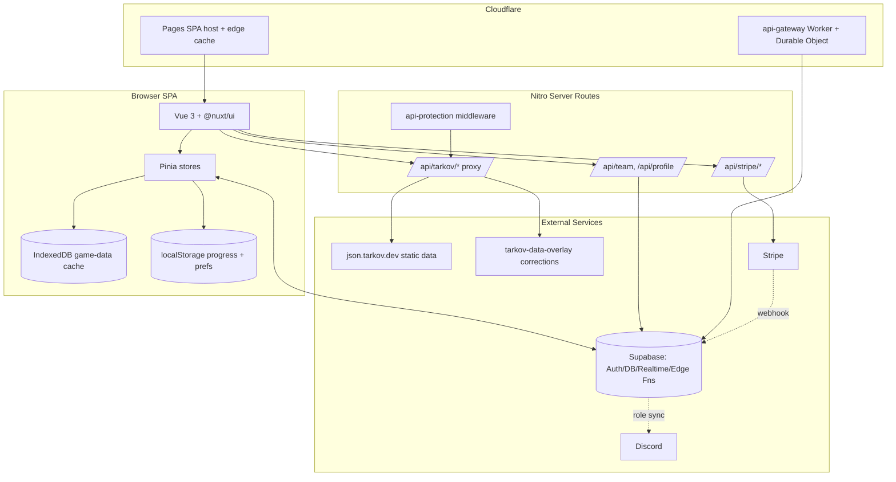
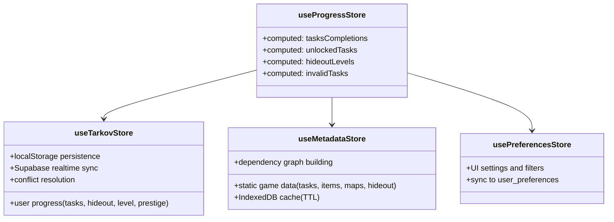
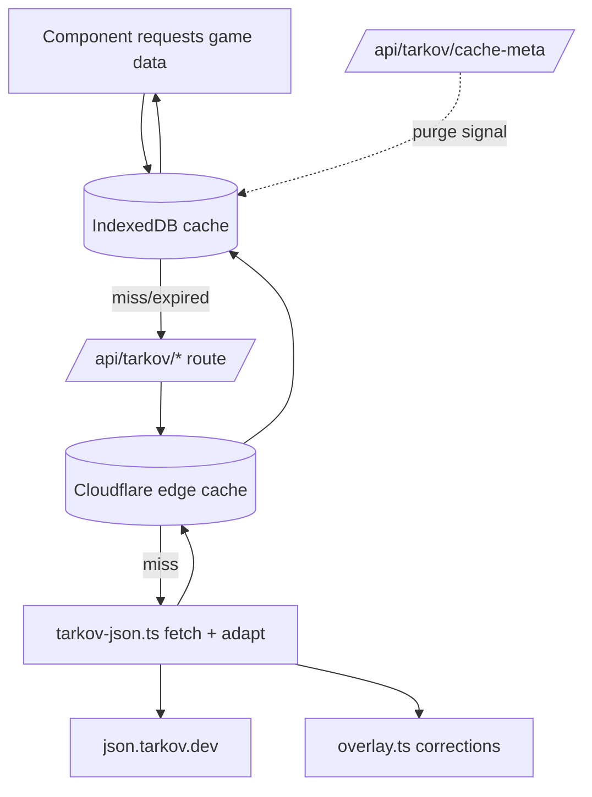

# Architecture — TarkovTracker

> Summary of the system architecture and design patterns. The authoritative, more detailed
> reference is `docs/ARCHITECTURE.md` (includes the canonical environment-variable map).

## Architectural Style

TarkovTracker is a **client-heavy SPA** (Nuxt 4 with `ssr: false`) backed by **Supabase** for auth,
persistence, and realtime, with a thin **Nitro server** that proxies and enriches static game data,
and a separate **Cloudflare Worker** that exposes a public, token-authenticated API.

Key consequences of `ssr: false`:

- No SSR-only Nuxt features (no server-side `useAsyncData` SSR options, no server-only route
  middleware patterns that assume SSR).
- The browser is the primary runtime; persistence is local-first (localStorage + IndexedDB) with
  Supabase as the synchronized source of truth when authenticated.

## State Management: Three Stores + Facade

The core pattern is a **three-store split with a computed facade** (see `components.md` for
per-store detail and `docs/ARCHITECTURE.md` for the rationale).

- **Separation of concerns:** user-owned mutable progress, externally-sourced immutable game data,
  and UI preferences are kept distinct so each can have its own persistence and sync strategy.
- **Facade:** `useProgressStore` exposes derived/combined values so components don't recombine raw
  state ad hoc. Mutation primitives live in `progressState.ts`; sync/merge internals live under
  `app/stores/tarkov/`.

## Data Sourcing and Caching

Game data originates from `json.tarkov.dev` and is **never fetched directly by the browser** —
it flows through Nitro proxy routes that apply community **overlay corrections** and edge caching,
then is cached client-side in IndexedDB.

- **Two-phase task loading:** core → objectives → rewards, so the UI renders early then hydrates.
- **Cache keys** encode endpoint + game mode + language (e.g., `tasks-core-json-v1-regular-en`).
- **Purge coordination:** `cache-meta` (never cached) advertises a server purge timestamp; the
  client clears stale IndexedDB entries accordingly.
- Implementation: `app/utils/tarkovCache.ts` (client), `app/server/utils/{tarkov-json,overlay,edgeCache,sharedEdgeStore}.ts` (server).

## Synchronization Model

When authenticated, `useTarkovStore` syncs progress with Supabase using local-first writes and a
debounced upsert, plus a realtime channel for remote changes.

- **Local-first:** mutations persist to localStorage immediately; Supabase upsert is debounced.
- **Realtime:** Postgres change events flow back through a realtime channel; self-origin echoes are
  filtered (short threshold) to avoid loops.
- **Conflict resolution:** sticky-complete semantics, timestamp-based merge, max-value preservation
  for counts/levels. Logic in `app/stores/tarkov/progressMerge.ts` + `conflictDetection.ts`.
- **Composables:** `app/composables/supabase/useSupabaseSync.ts` and `useSupabaseListener.ts`.

## Authentication

- Supabase auth (OAuth providers + email). Client plugin: `app/plugins/supabase.client.ts`.
- **OAuth popup flow** with redirect fallback and abandonment timers (`useOAuthLogin.ts`,
  `app/pages/auth/callback.vue`); detailed timer behavior is documented in `docs/ARCHITECTURE.md`.
- Route protection: `app/middleware/auth.ts` (auth) and `app/middleware/admin.ts` (admin gating).
- Server-side: `app/server/middleware/api-protection.ts` validates tokens, applies CORS, and
  enforces host/IP allowlists with a configurable public-route list.

## Public API Gateway (Separate Trust Boundary)

`workers/api-gateway` is a standalone Cloudflare Worker exposing a public REST API authenticated by
hashed API tokens (created/revoked via Supabase Edge Functions). It uses a **Durable Object**
(`ApiGatewayRateLimiter`) for distributed rate limiting and ships an OpenAPI spec. It reads/writes
the same Supabase progress data through RPCs. This is intentionally decoupled from the Nuxt app.

## Security Model

- **API protection middleware** gates Nitro routes (auth required by default; explicit public-route
  allowlist for `/api/tarkov/*` and the tarkov-dev profile proxy).
- **Supabase RLS** governs all user-owned tables; mutations that need elevated privileges or
  rate limiting are funneled through Edge Functions (per-user rate limited via RPC).
- **Secrets** are never committed; values come from runtime config (`useRuntimeConfig()`), resolved
  in `app/utils/runtimeConfig.ts`. Environment naming is split: `NUXT_PUBLIC_*` (browser),
  `NUXT_*` (server-only), and platform-native names (`SUPABASE_*`, `STRIPE_*`, `DISCORD_*`,
  `CLOUDFLARE_*`) for Edge Functions.
- **CSP / security headers** configured in `nuxt.config.ts` and `app/utils/csp.ts`.
- In-memory caches/rate-limiters in some Nitro routes are per-instance (not shared across serverless
  instances) — see README "Server API Runtime Notes".

## Performance Patterns

- IndexedDB caching to minimize network round-trips.
- Idle scheduling of non-critical fetches (`app/utils/idleScheduler.ts`).
- Precomputed dependency graphs for O(1) task/hideout prerequisite lookups
  (`app/utils/graphHelpers.ts`, `app/composables/useGraphBuilder.ts`).
- Incremental/infinite list loading for large item and task lists (`useInfiniteScroll.ts`).
- Manual vendor chunking in the Nuxt/Vite build.

## Design Principles Observed

- SPA-only; local-first with cloud sync.
- Feature-slice organization under `app/features/`.
- `@/` path aliases only (no parent-relative imports; ESLint-enforced).
- Tailwind v4 theme tokens only — no inline hex, no `<style>` blocks.
- Strict TypeScript; avoid `any`; reuse shared types in `app/types/`.
- Keep server handlers small and composable; push logic into composables/utils.
