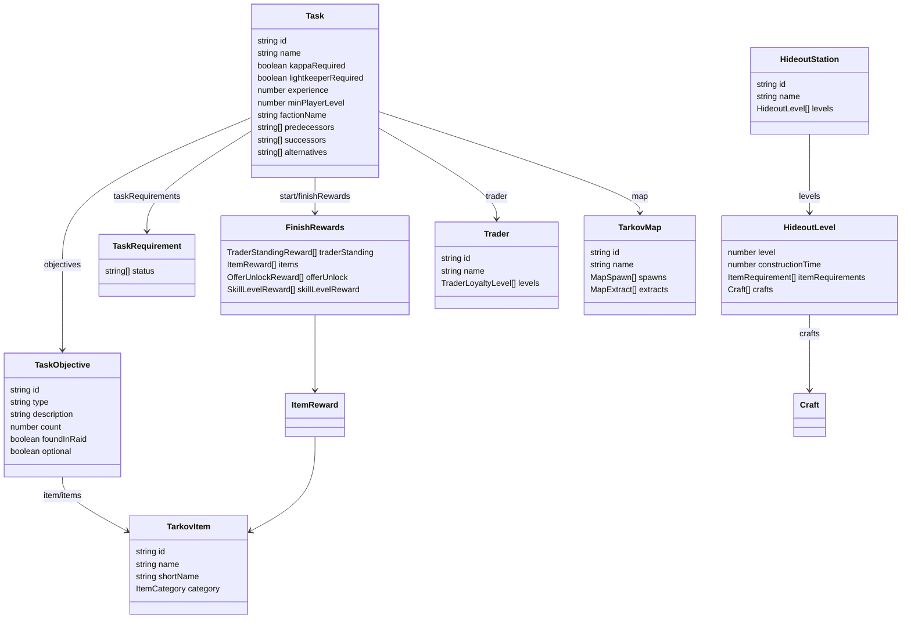
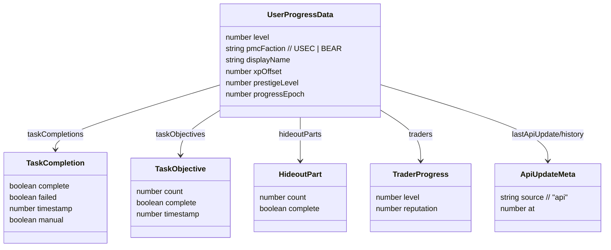
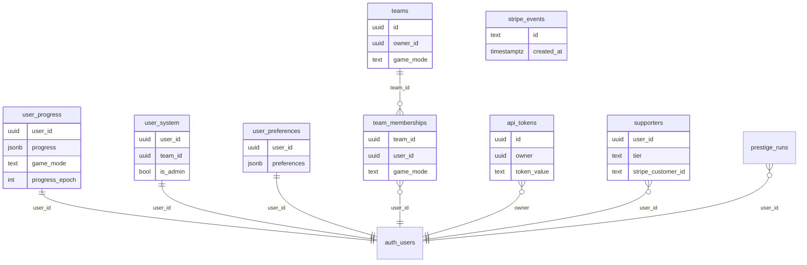

# Data Models — TarkovTracker

> Core data structures. Two domains: **game data** (immutable, from tarkov.dev) defined in
> `app/types/tarkov.ts`, and **user progress** (mutable, synced) defined in `app/types/progress.ts`
> and the Supabase schema. Edge Function/DB types are generated in
> `supabase/functions/_shared/database.types.ts` — do not duplicate them by hand.

## Game Data Model (`app/types/tarkov.ts`)

### Key game-data types

| Type                                                                       | Purpose                     | Notable fields                                                                                                                                                    |
| -------------------------------------------------------------------------- | --------------------------- | ----------------------------------------------------------------------------------------------------------------------------------------------------------------- |
| `Task`                                                                     | A quest                     | `kappaRequired`, `lightkeeperRequired`, `minPlayerLevel`, `taskRequirements`, `predecessors`/`successors`/`parents`/`children`, `alternatives`, `disabled`        |
| `TaskObjective`                                                            | One objective within a task | `type`, `count`, `foundInRaid`, `optional`, `items`/`markerItem`/`questItem`, `zones`/`possibleLocations`, `requiredKeys`                                         |
| `TaskRequirement`                                                          | Prereq link to another task | `task.id`, `status[]`                                                                                                                                             |
| `RequiredKeyGroup`                                                         | Keys needed for a task      | `keys[]`, `maps[]`, `optional`, `anyOf`                                                                                                                           |
| `FinishRewards`                                                            | Quest rewards               | `traderStanding`, `items`, `offerUnlock`, `skillLevelReward`, `traderUnlock`                                                                                      |
| `HideoutStation` / `HideoutLevel` / `HideoutModule`                        | Hideout data + graph nodes  | `itemRequirements`, `stationLevelRequirements`, `skillRequirements`, `traderRequirements`, `crafts`; module adds `predecessors`/`successors`/`parents`/`children` |
| `TarkovItem` / `ItemRequirement`                                           | Items + quantities          | `shortName`, `category`, `containsItems`; requirement adds `count`, `quantity`, `foundInRaid`                                                                     |
| `Trader` / `TraderLoyaltyLevel`                                            | Traders + loyalty           | `requiredPlayerLevel`, `requiredReputation`, `requiredCommerce`                                                                                                   |
| `TarkovMap` / `MapSpawn` / `MapExtract` / `MapSvgConfig` / `MapTileConfig` | Maps + geometry             | spawn `position`, extract `faction`, SVG/tile `bounds`, `coordinateRotation`, `floors`                                                                            |
| `PlayerLevel`                                                              | Level XP thresholds         | `exp` stored as **cumulative** (transformed from API increments)                                                                                                  |
| `PrestigeLevel`                                                            | Prestige tiers (0–6)        | `conditions`, `rewards`, `transferSettings`                                                                                                                       |
| `StoryChapter` / `StoryObjective`                                          | Storyline progression       | `order`, `mutuallyExclusiveWith`, `mapUnlocks`, `traderUnlocks`                                                                                                   |
| `GameEdition`                                                              | Game edition bonuses        | `defaultStashLevel`, `traderRepBonus`, `exclusiveTaskIds`, `excludedTaskIds`                                                                                      |

### Query result types

`tarkov.ts` also defines the response envelopes used by the metadata store and proxy adapters:
`TarkovBootstrapQueryResult`, `TarkovTasksCoreQueryResult`, `TarkovTaskObjectivesQueryResult`,
`TarkovTaskRewardsQueryResult`, `TarkovHideoutQueryResult`, `TarkovItemsQueryResult`,
`TarkovMapSpawnsQueryResult`, `TarkovPrestigeQueryResult`.

### Needed-items aggregation types

`NeededItemTaskObjective` and `NeededItemHideoutModule` (discriminated by `needType`) feed into
`GroupedNeededItem`, which aggregates per-item totals across tasks and hideout with FIR / non-FIR
split and current-progress counters (`taskFir`, `hideoutNonFir`, computed `total`/`currentCount`).

## User Progress Model (`app/types/progress.ts`)

`UserProgressData` is the persisted/synced progress record per game mode.

Maps keyed by id: `taskObjectives`, `taskCompletions`, `hideoutParts`, `hideoutModules`,
`traders`, `skills`, `skillOffsets`, `storyChapters`. Also tracks `lastApiUpdate` and
`apiUpdateHistory` for API-driven changes.

## Store State Types

Defined in `app/types/tarkov.ts`:

- `SystemState` / `SystemGetters` — `user_id`, `tokens`, `team`, `pvp_team_id`, `pve_team_id`,
  `is_admin`; getters `userTokens`, `userTeam`, `userTeamIsOwn`, `isAdmin`.
- `TeamState` / `TeamGetters` — `owner`, `joinCode`, `members`, `memberProfiles`; getters
  `teamOwner`, `isOwner`, `inviteCode`, `teamMembers`, `teammates`.
- `MemberProfile` — `displayName`, `level`, `tasksCompleted`, `gameMode` (`pvp`|`pve`).

## Supabase Data Model

Derived from `supabase/migrations/`. RLS is enabled on user-owned tables; some operations go
through RPCs/Edge Functions for elevated privileges or rate limiting.

| Table / object               | Role                                                                                        |
| ---------------------------- | ------------------------------------------------------------------------------------------- |
| `user_progress`              | Per-user, per-mode progress JSON; realtime-enabled; payload sanitized via trigger/RPC       |
| `user_system`                | Per-user system row (team linkage, admin flag — admin column privilege-locked)              |
| `user_preferences`           | Per-user UI preferences (columns added incrementally via migrations)                        |
| `teams` / `team_memberships` | Team ownership + membership (game-mode aware; RLS tuned to avoid recursion)                 |
| `api_tokens`                 | Hashed API tokens for the gateway                                                           |
| `supporters`                 | Supporter tier + Stripe customer linkage                                                    |
| `stripe_events`              | Idempotency/retention for webhook events                                                    |
| `prestige_runs`              | Prestige run history (+ progress epoch)                                                     |
| `account_deletion_jobs`      | Account deletion job tracking                                                               |
| `admin_audit_log`            | Admin action audit trail                                                                    |
| RPCs                         | API gateway functions, atomic prestige progress, mutation rate limiting, ownership transfer |

> Game modes appear as `regular`/`pve` in the game-data API and `pvp`/`pve` in
> team/profile/membership contexts. Treat them as the same two-mode concept across layers.

## Static Local Data

- `app/data/maps.json` — map SVG/tile configuration (static).
- Storyline objective mutual-exclusion defaults live in `app/utils/storylineObjectives.ts`.
