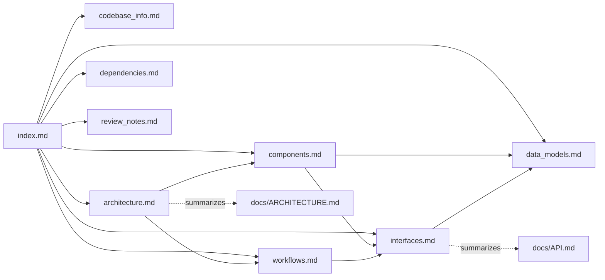

# TarkovTracker Documentation Knowledge Base — Index

This directory is an **auto-generated knowledge base** describing the TarkovTracker codebase for
AI assistants and human contributors. This `index.md` is the **primary entry point**: load it first
to decide which detailed file(s) to read for a given question.

## How AI Assistants Should Use This Knowledge Base

1. **Start here.** Read this index to understand what each file covers.
2. **Route to the right file** using the "Question Routing" table below — pull only the file(s) you
   need rather than loading everything.
3. **Prefer authoritative sources.** These generated docs summarize and cross-reference the
   repository's hand-maintained docs. When in doubt, defer in this order:
   1. Executable config (`nuxt.config.ts`, `eslint.config.mjs`, `.prettierrc`, `tsconfig`, `package.json`)
   2. Root `AGENTS.md` (agent contract)
   3. `docs/ARCHITECTURE.md` and `docs/API.md` (hand-maintained, authoritative)
   4. These generated summary docs
4. **Verify before claiming.** These docs avoid volatile metrics, but file contents drift. Confirm
   specifics against the cited source files before making changes.

## Documents in This Knowledge Base

| File               | Purpose                                                                                     | Read when you need…                       |
| ------------------ | ------------------------------------------------------------------------------------------- | ----------------------------------------- |
| `index.md`         | This file — navigation + routing                                                            | To orient and decide what to read         |
| `codebase_info.md` | Stack, directory map, feature slices, tooling, hierarchical diagram                         | A structural overview / where code lives  |
| `architecture.md`  | System architecture, patterns, state model, sync, caching, security                         | How the system fits together and _why_    |
| `components.md`    | Major components (stores, composables, server utils, features, worker) and responsibilities | What a specific module/component does     |
| `interfaces.md`    | HTTP endpoints, public API gateway, Edge Functions, MCP servers, integration points         | Request/response shapes and boundaries    |
| `data_models.md`   | Core TypeScript types and Supabase data model                                               | Data shapes (Task, progress, DB tables)   |
| `workflows.md`     | Key processes: data fetch, sync, auth, teams, imports, payments, deploy                     | How an end-to-end flow works step by step |
| `dependencies.md`  | External dependencies and how/why they are used                                             | Why a library is present / its role       |
| `review_notes.md`  | Consistency + completeness review and recommendations                                       | Known gaps and doc-quality caveats        |

## Question Routing

| If the question is about…                             | Read                                                           |
| ----------------------------------------------------- | -------------------------------------------------------------- |
| "Where does X live?" / project structure              | `codebase_info.md`                                             |
| "How is state managed?" / sync / conflict resolution  | `architecture.md`, `components.md`, `workflows.md`             |
| "What does this store/composable/util do?"            | `components.md`                                                |
| "What endpoints exist?" / API contract / rate limits  | `interfaces.md`, `workflows.md`                                |
| "What fields does a Task / progress record have?"     | `data_models.md`                                               |
| "How does login / team join / import / payment work?" | `workflows.md`                                                 |
| "Why is dependency Y here?" / build tooling           | `dependencies.md`                                              |
| "What conventions/guardrails must I follow?"          | root `AGENTS.md`, `docs/agent-context/style-and-validation.md` |
| Environment variables                                 | `architecture.md` + `docs/ARCHITECTURE.md` (canonical env map) |

## Cross-References (Repository Docs)

These generated docs complement — and do not replace — the hand-maintained docs:

- Root `AGENTS.md` — canonical agent contract (commands, hard rules, conventions).
- `docs/ARCHITECTURE.md` — authoritative architecture + canonical environment variable map.
- `docs/API.md` — authoritative API reference (endpoints, caching, languages, game modes).
- `docs/agent-context/README.md` + `style-and-validation.md` — task-oriented agent guidance.
- `.github/CONTRIBUTING.md`, `docs/runbook.md`, `docs/WORKFLOW_AUTOMATION.md`,
  `docs/agent-context/codex-analytics-setup.md`, `DESIGN.md`.

## Relationships Between Documents

## Maintenance

Regenerate this knowledge base when architecture, the public API, the data model, or the module
layout changes materially. Keep the hand-maintained `docs/ARCHITECTURE.md` and `docs/API.md` as the
sources of truth; this directory should track them, not diverge.
