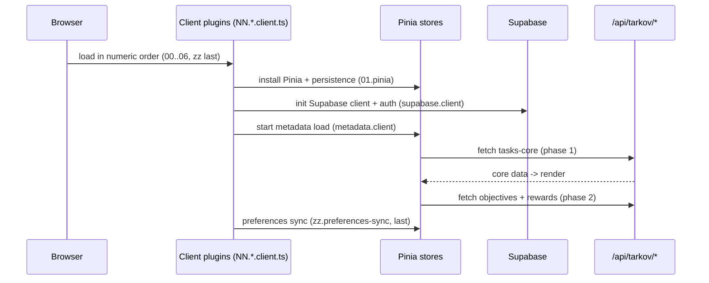
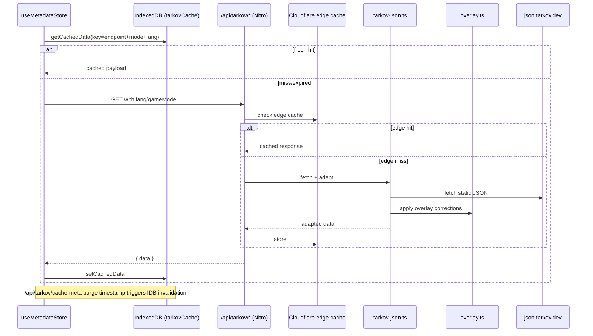
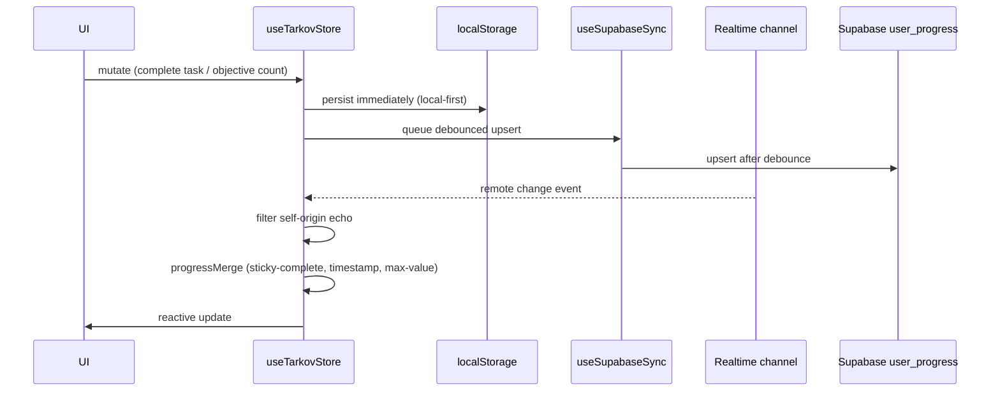
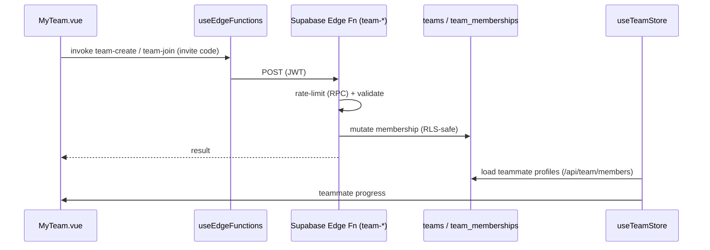
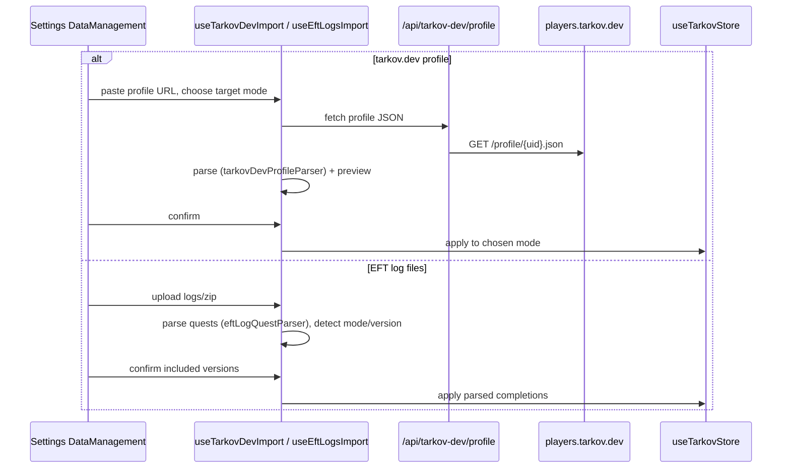
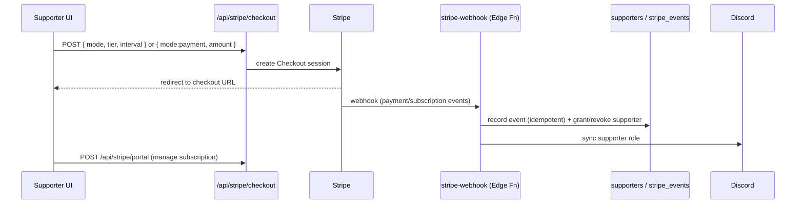
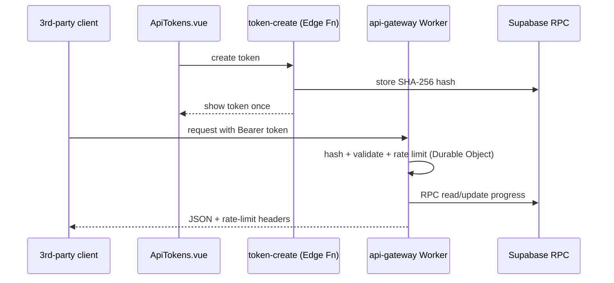
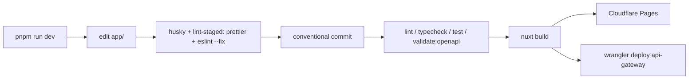

# Workflows — TarkovTracker

> Key end-to-end processes. Each section names the components involved so you can jump to source.

## 1. App Initialization



Entry points: `app/composables/useAppInitialization.ts`, `app/plugins/*`, `useMetadataStore.initialize()`.

## 2. Game-Data Fetch with Caching + Overlay



## 3. Progress Sync (authenticated)



Components: `app/stores/useTarkov.ts`, `app/stores/tarkov/{progressMerge,conflictDetection,realtimeListener}.ts`,
`app/composables/supabase/{useSupabaseSync,useSupabaseListener}.ts`.

## 4. OAuth Login (popup with redirect fallback)

```mermaid
sequenceDiagram
    participant Login as login.vue / useOAuthLogin
    participant Popup as OAuth popup
    participant CB as /auth/callback
    participant SB as Supabase

    Login->>Login: loading[provider]=true; start poll/fallback/abandon timers
    Login->>Popup: window.open(provider URL)
    Popup->>SB: provider auth
    SB-->>CB: redirect back
    CB-->>Popup: postMessage(OAUTH_SUCCESS)
    Popup-->>Login: message event
    Login->>Login: cleanup(); navigate to safe redirect
    alt popup blocked / closed early
        Login->>Login: fallbackTimer + !popupConfirmedOpen -> fallbackToRedirect()
    end
```

Detailed timer semantics are documented in `docs/ARCHITECTURE.md`. Redirect targets are validated
(`app/utils/redirect.ts`, `oauthConsent.ts`).

## 5. Team Collaboration



Functions: `team-create`, `team-join`, `team-leave`, `team-kick`, `team-members`. Owner transfer and
membership sync are handled by migrations/RPCs.

## 6. Progress Import (tarkov.dev profile / EFT logs)



Notes: only the linked `tarkovUid` is persisted; imports always ask which mode to write into and
default to the active mode; legacy embedded profile blobs are sanitized out. tarkov.dev URL slug:
`regular` → PvP, `pve` → PvE.

## 7. Supporter Payment (Stripe)



Validation: `app/server/utils/stripeCheckoutValidation.ts`; customer lookup:
`supporterCustomerLookup.ts`; refunds/disputes revoke access in `stripe-webhook`.

## 8. Public API Access (gateway)



## 9. Account Deletion

User requests deletion → `account-delete` Edge Function enqueues a job
(`account_deletion_jobs`) and removes user data; `account-delete-reconcile` reconciles/cleans up
residual data. Rate-limited and audited.

## 10. Localization Workflow

- `app/locales/en.json` is the **only** file to edit (source locale).
- Non-English locales are **Crowdin-owned** exports — never hand-edit or copy English in as a fallback.
- Add user-facing copy as snake_case keys with `t('key', 'Fallback')`, then run `pnpm run i18n:check`
  (fatal only on snake_case violations in `en.json`). vue-i18n falls back to `en`.

## 11. Build, Validate, Deploy



Pre-finish validation policy (root `AGENTS.md`): run the smallest relevant check — `typecheck` for
TS changes, `lint` for code, `i18n:check` for locale changes. Avoid running the full suite unless
test logic or executable code changed. Formatting is handled by the pre-commit hook.
